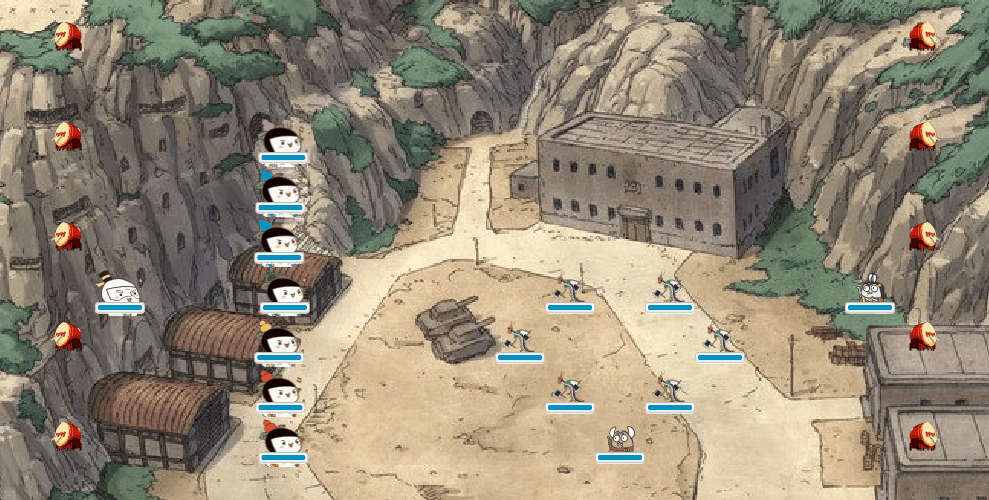

# Final Project Version2(2018.12.29)
## 更新的内容
### 对界面进行美化
- 对葫芦娃、老爷爷、蛇精等角色的图片进行了处理，将周围空白部分去除，使得看上去更自然。
- 换了背景图片、使得画风更贴近葫芦娃峡谷的风格，在两侧摆放了战鼓，显得更有气势。

### 新增功能
- 主要增加了战斗过程的文本实时显示功能，使得每一步动作都有可视化的记录。

### 重构代码
- 对于代码的结构整体进行了重构，尽力做到符合设计原则。

### 更新README
- 根据新的版本重新完善了Version1的相关说明。

# Final Project Version1(2018.12.26)
## 效果展示

  

## 说明
### 操作说明
- 首先使用mvn clean test package命令,然后使用java -jar命令运行target文件下的WarComing-1.0-SNAPSHOT.jar文件来启动程序。   
- 有四个按钮：开始战斗（就可以动起来（可以空格启动））、结束战斗（战斗过程中可强制结束）、开始回放（选择战斗记录文件进行回放）、结束回放（可以强制结束回放）。   
- 注意：如果当前的战斗或者回放没有进行完就想进行下一场战斗或者回放，一定要先点击结束战斗或者结束回放按钮。  

### 文件结构说明
下面是文件的结构   
goodreplay 存放筛选出的战斗记录文件   
pics  存放效果展示图   
pom.xml   
README.md   
- src 源代码   
- src/main 主程序   
- src/main/java 存放主程序模块    
- src/main/java/Role 角色包   
- src/main/java/Forms 阵型包   
- src/main/java/Space 战场包   
- src/main/java/Gui 界面包    
- src/main/resources 资源文件以及运行时生成的战斗记录文件      
- src/main/resources/icons 存放图标、图片资源   
- src/main/resources/records 存放战斗记录   
- src/test  单元测试     
- src/test/java 存放测试模块   


## 设计
### 葫芦娃VS妖怪 扔石子？不！近战硬碰硬才是王道！  
葫芦娃是啥？大娃力大无穷、二娃千里眼顺风耳、三娃金刚不坏、四娃喷火、五娃吐水、六娃来无影去无踪、七娃手提宝葫芦，请问哪一个像是扔石子滴。再看那妖怪，蛇精有神秘莫测的如意、蝎子精有强健的体格还有力大无比的钳子，手下那帮喽啰也不是吃软饭的。     
综上胡扯，扔石子不是应该有的战斗方式。Anyway,游戏的设定就是近战，反应到程序里就是：当两者靠在一起（即在战场上处于相邻的格子）的时候就开始战斗。
### 没有绝技何以游四海
七个葫芦娃，爷爷、蛇精、蝎子精、喽啰，当然要有各自的设定。
<font size="1">
<table>
        <tr>
            <th>名称</th>
            <th>生命值</th>
            <th>攻击力</th>
            <th>防御力</th>
            <th>命中率</th>
            <th>疲劳损耗</th>
            <th>说明</th>
        </tr>
        <tr>
            <th>大娃</th>
            <th>500</th>
            <th>120</th>
            <th>30</th>
            <th>7</th>
            <th>15</th>
            <th>大娃力大无穷，攻击力高，但是命中率和疲劳损耗相应也高</th>
        </tr>
        <tr>
            <th>二娃</th>
            <th>300</th>
            <th>70</th>
            <th>20</th>
            <th>10</th>
            <th>7</th>
            <th>二娃眼耳极好，虽攻击防御不行，但命中率极高</th>
        </tr>
        <tr>
            <th>三娃</th>
            <th>300</th>
            <th>100</th>
            <th>60</th>
            <th>8</th>
            <th>8</th>
            <th>三娃金刚不坏，防御力很高</th>
        </tr>
        <tr>
            <th>四娃</th>
            <th>300</th>
            <th>100</th>
            <th>25</th>
            <th>8</th>
            <th>8</th>
            <th>四娃掌控喷火之术，各属性较为均衡</th>
        </tr>
        <tr>
            <th>五娃</th>
            <th>300</th>
            <th>100</th>
            <th>25</th>
            <th>8</th>
            <th>8</th>
            <th>五娃精通吐水之术，各属性较为均衡</th>
        </tr>
        <tr>
            <th>六娃</th>
            <th>200</th>
            <th>200</th>
            <th>10</th>
            <th>90</th>
            <th>10</th>
            <th>六娃有隐身天赋，是刺客般的存在，拥有秒杀的攻击力</th>
        </tr>
        <tr>
            <th>七娃</th>
            <th>300</th>
            <th>100</th>
            <th>25</th>
            <th>8</th>
            <th>8</th>
            <th>七娃虽最小，但有宝葫芦护体，依旧很猛</th>
        </tr>
          <tr>
            <th>老爷爷</th>
            <th>200</th>
            <th>60</th>
            <th>40</th>
            <th>6</th>
            <th>8</th>
            <th>生命值和攻击力低，但是防御力挺高</th>
        </tr>
        <tr>
            <th>蝎子精</th>
            <th>600</th>
            <th>150</th>
            <th>50</th>
            <th>9</th>
            <th>12</th>
            <th>血厚、攻高、抗性高、是真正的大Boss</th>
        </tr>
        <tr>
            <th>蛇精</th>
            <th>400</th>
            <th>120</th>
            <th>30</th>
            <th>9</th>
            <th>8</th>
            <th>拥有如意法宝，伤害绝不逊色</th>
        </tr>
        <tr>
            <th>喽啰</th>
            <th>250</th>
            <th>90</th>
            <th>20</th>
            <th>9</th>
            <th>7</th>
            <th>大战在即，也是挑出了洞穴一等一的战士</th>
        </tr>
    </table>
</font>
说明 真正战斗的时候，真实伤害 = 攻击者的攻击力 - 被攻击者的防御力，命中率则会根据随机加权算法决定这次攻击是否成功。

### 墓碑难题：猴年马月的战斗
这可以说是这款小游戏最让我头疼的地方。最基本的设定就是葫芦娃向妖怪靠拢，妖怪向葫芦娃靠拢，然后厮杀。问题就是题目要求战斗中死的一方要留下实体（也就是墓碑），墓碑留下就会形成阻隔，而正常的寻路径的算法只能保证葫芦娃和妖怪是在靠近的，却无法保证其相遇。所以经常有的情况就是墓碑形成了一条长城，左边是葫芦娃，右边是妖怪，永远不会相遇，也意味着游戏永远不会结束。咨询了同学之后我发现他们用的比较多的是让墓碑过一段时间消失。我细想只后发现还是挺不科学，为什么尸体就那样消失了呢，难道说打仗的时候还有人有功夫去给你收尸吗？   
感觉让墓碑消失不是特别实际的事情，于是接下来我做了三次不同的尝试。   
第一次尝试是利用随机性打乱位置，试图能开辟出相遇的路径。也就是说，当葫芦娃向妖怪靠近时如果被墓碑阻隔，不会选择不动，而是从能走的方向里选择一个方向进行移动。经过试验发现，大多数的情况下确实可以结束，但是需要的时间太长，因为毕竟随机性的影响太大，可能要僵持很久才能结束。   
第二次尝试是设定一个时间后，超过这个时候后战场上的所有人都有一定的概率暴毙，无法解释这个事情，就是为了游戏结束而强行的设定，确实很不符合实际。   
第三次尝试是给角色加了血条之后，突然触发的灵感，我使用了疲劳损耗这一设定，就是每一次移动或者战斗，都会消耗一点生命值，结合到现实的话就是每次行动都会有消耗，这样的设定下，每个角色都会有自己的存活时间，绝对不会一直跑下去而不会结束。   

### 小小动画：皮之开场和收场
开场的时候，葫芦娃会蛇形前后摆动，挑衅示威。   

  

收场的时候，获得战斗胜利的那一方会硬核旋转，庆祝胜利。
     

## 实现

### 继承、封装、多态
以Existence.java为例，使用了抽象类、继承、接口等手段对于葫芦娃世界和葫芦娃的生物进行了合理的设计。   
下面附上Existence.java的类图：   

   

### 输入输出、异常处理
将战斗过程保存为文件以及读取文件解析并进行回放时用到了文件IO的操作，利用FileReader和FileWriter类实现了字符流的输入输出。   
并且进行了异常处理，使用了try catch的java异常处理机制，保证字符流的稳定操作。   
贴部分代码如下：  
```java
public synchronized void RecordToFile(int quality, int index, int old_x, int old_y, int new_x, int new_y, int hp)
{
    try {
        FileWriter fw = new FileWriter("src/main/resources/records/"+ fight_num + ".txt",isappend);
        isappend = true;
        BufferedWriter bw = new BufferedWriter(fw);
        bw.write(String.valueOf(quality));bw.append(" ");
        bw.write(String.valueOf(index));bw.append(" ");
        bw.write(String.valueOf(old_x));bw.append(" ");
        bw.write(String.valueOf(old_y));bw.append(" ");
        bw.write(String.valueOf(new_x));bw.append(" ");
        bw.write(String.valueOf(new_y));bw.append(" ");
        bw.write(String.valueOf(hp));bw.newLine();
        bw.flush();
        bw.close();
        fw.close();
    } catch (IOException e) {
        e.printStackTrace();
    }
}
```

### 集合、泛型
一开始对于每个角色都是分别创建一个对象，然后利用创建的对象去完成相应的操作，这里并没有利用起java的泛型机制。
```java
lineup = new Lineup();
grandpa = new Grandpa();
demonsnake = new DemonSnake();
demonscorpion = new DemonScorpion();
lackey = new Lackey[6];
for(int i = 0; i < 6; i++)
    lackey[i] = new Lackey();
battleground = new Battleground(20);
```
考虑到GUI的设计，发现敌对关系就只有一个：葫芦娃和妖精。因此将以上的角色分为2个阵营有利于操作，分别是good阵营和bad阵营，使用了List和ArrayList这两个集合，结合泛型的机制，利用java多态的特性而得以统一操作，不仅简化了代码，而且避免了很多可能的逻辑错误，以及对于敌对关系有更简洁的判定（其实就是判断在哪个正营就行了），下面是阵营的划分：   

```java
good.add(grandpa);
for(int i = 0; i < 7; i++)
    good.add(lineup.getLine()[i]);
bad.add(demonscorpion);
bad.add(demonsnake);
for(int i = 0; i < 6; i++)
    bad.add(lackey[i]);
```

### 多线程
对于多线程的需求，我统一使用了Timer这个类，这个类是继承了TimeThread类，这个类的提供了一个接口，就是可以定时运行定义的TimeTask里的run接口。使用这个时间线程的好处就是，它可以每隔一段时间就执行定义的操作，这正是需要的。考虑到葫芦娃每隔一段时间寻找路径、战斗、界面每隔一段时间刷新，我觉得TimeThread时间线程是一个很不错的选择。因此就给每一个角色都创建了一个时间线程，然后将每次移动、战斗以及界面刷新都放入TimeTask，这样就可以每隔一段时间就执行。下面是其中一个时间线程的实现：   
```java
TimerTask task0 = new TimerTask() {
    @Override
    public void run() {
        Platform.runLater(() -> {
            if(task0_end == true)
            {
                cancel();
                System.gc();
            }
            if(good.get(0).getState() == 0) {

                cancel();
                System.gc();
            }
            else {
                boolean ret = MoveOn(good.get(0));
                Refresh(root);
                if(ret == false)
                {

                    cancel();
                    System.gc();
                }
            }
        });
    }
};
Timer timer0 = new Timer();
timer0.scheduleAtFixedRate(task0,2500,1000);
```

### 单元测试、注解
单元测试使用第三方测试工具junit，其测试方法是使用assert断言机制，对比程序运行结果和预期结果是否一致。   
并且使用了@Test注解，还使用了timeout的单元测试来计算文件读写的时间，从而检测其性能。
```java
 @Test(timeout = 2000)
    public void TimeTest(){
        for(int i = 0; i < 300; i++) {
            String filepath = "testio.txt";
            int to_x = 100;
            int from_x = 0;

            Fileop.FileWrite(filepath, to_x);
            from_x = Fileop.FileRead(filepath);
            File f = new File("testio.txt");
            if (f.exists() && f.isFile())
                f.delete();
        }
    }
```

## 感悟和致谢
### 感悟
最大的感悟就是平时的小作业没有拖延是真的幸运，否则真不知道大作业何时才能写完。学javafx的无奈、调多线程bug时的崩溃，做不出想要界面效果的苦笑、没及时退课的后悔（这个从没有后悔，只是皮一下哈哈），这些种种烦恼都在完成后烟消云散，或许这就是成长吧。唯一值得自己反思的是期末考试，尽管上课听得挺认真、复习也挺细致，但是由于平时还是代码写得不多，导致通篇代码的试卷打了我个措手不及，理论终究是理论，我印象最深就是曹老师有一张Slide上的一句话“Talk cheap, Give me the code”,确实，学习java课程，不多写代码，不亲子动手去实现一下课上的内容，对于java精髓的理解就不会有多深，也算是一个教训吧哈哈。   

### 致谢
感谢曹老师和余老师干货满满的授课，感谢葛助教和李助教平时耐心地解答。